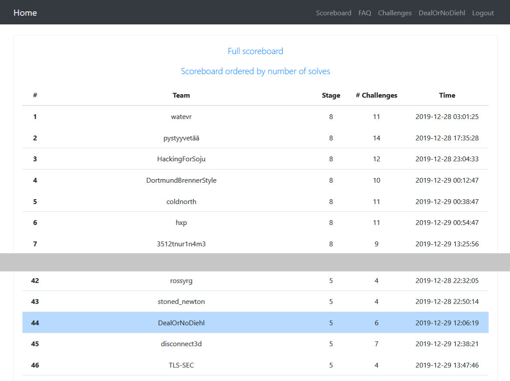

# 36c3-ctf

*This repository contanins documentation of how we've solved some of the 36c3 junior ctf challenges.*

You can find a folder for every challenge including some prerequisites.

All the challenges can be found on https://kuchenblech.xyz/

Thanks to the collaborators:

 - [@dev-jan](https://github.com/dev-jan)
 - [@eddex](https://github.com/eddex)
 - [@Lextum](https://github.com/Lextum)

## Scoreboard

We managed to place ourselves on rank 44 from a total of 817 registered teams (237 teams solved at least 1 challenge)

